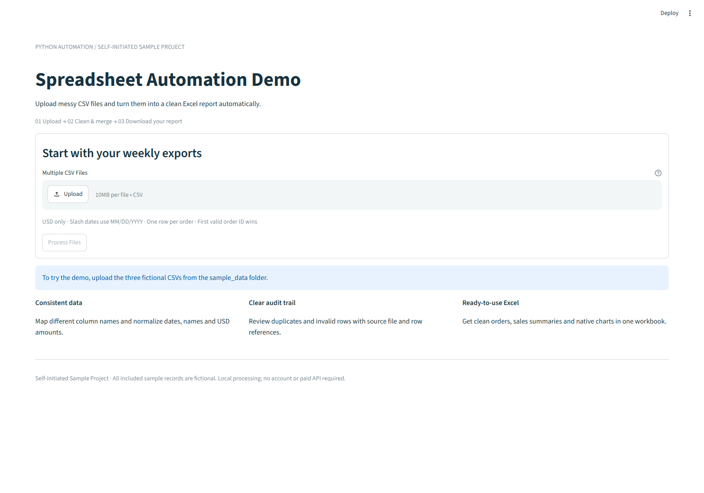
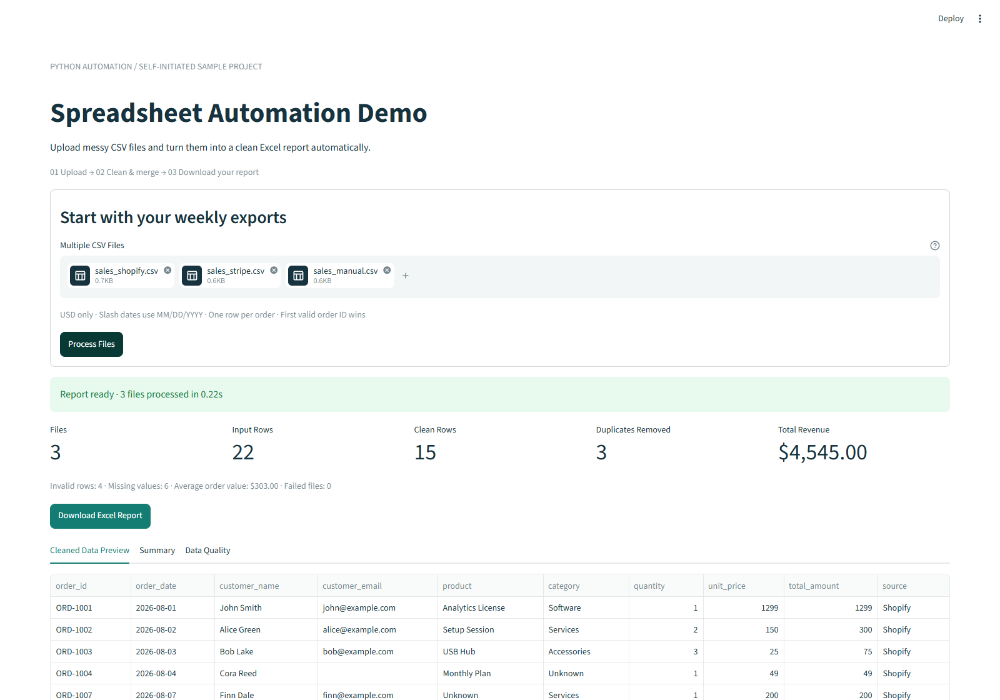
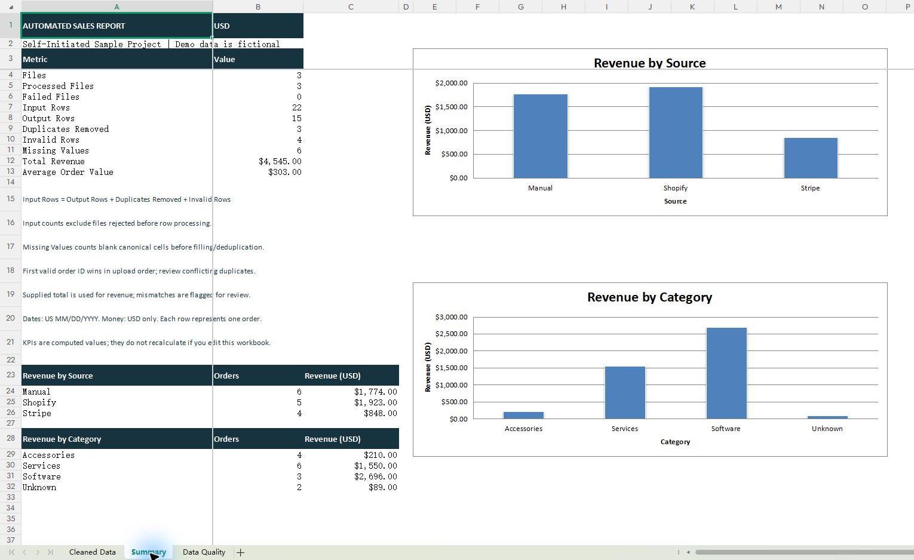
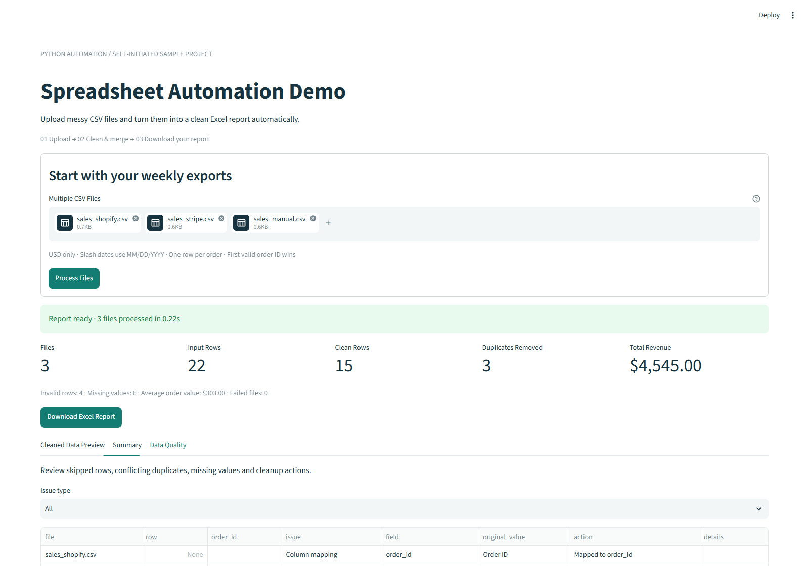

# Spreadsheet Automation & Reporting Tool

## Project Overview

**Self-Initiated Sample Project** — a local demonstration of fixed-rule CSV cleaning and Excel reporting.
All included records, customer names and sales figures are fictional. The repository contains the
application, reusable data-processing modules, sample exports, tests and genuine demo screenshots.

## Business Problem

Many small teams manually combine weekly exports from multiple systems. Different column names,
inconsistent dates, formatted amounts, missing fields and repeated orders make that work error-prone.

## Solution

The tool cleans, normalizes, merges and reports automatically. Upload CSV exports with supported column names,
click **Process Files**, review the results and download a formatted Excel workbook.
Every rejected row and duplicate is recorded with its source file and CSV line reference.

This sample uses explicit, fixed-rule column mappings. For real client projects, mappings can be adapted after reviewing anonymized sample files and agreeing on the data rules.

## Features

- Multiple CSV uploads with three explicit, fixed-rule column mappings maintained in code.
- Date, USD amount, customer-name and email normalization.
- Order ID deduplication across files, including conflicting-value warnings.
- Missing-field tracking, invalid-row isolation and original rejected-row details.
- Revenue, order counts, average order value and source/category summaries.
- Excel with **Cleaned Data**, **Summary**, and **Data Quality**, plus two native charts.
- Bold headers, filters, frozen panes, fitted column widths, date and money formats.
- Partial-batch processing when a file is rejected; understandable error messages.
- Uploaded text is written as literal Excel text, never executable formulas.
- No accounts, database, paid API or cloud backend.

## Screenshots

Actual captures from the running demo and its generated workbook, using fictional sample data.
The workbook screenshots were captured in WPS Office; they are not Microsoft Excel desktop verification.

### Upload CSV files



### Processed dashboard



### Excel summary and native charts



### Data quality review



Additional captures and their provenance are listed in [screenshots/README.md](screenshots/README.md).
No public live-demo or video link is included in this release.

## Tech Stack

Python 3.11+ (tested with 3.12), pandas, openpyxl, Streamlit and pytest.
Optional browser acceptance checks use Playwright. Runtime package versions are pinned in `requirements.txt`.

## How to Run

### Windows: double-click setup

1. Install Python 3.11 or later from [python.org](https://www.python.org/downloads/windows/).
   Enable **Add Python to PATH** during installation. Python 3.12 is the tested version.
2. Download this project and extract the ZIP before running any files.
3. Double-click **setup_windows.bat**. Wait for “Setup complete”. The first setup needs Internet access.
4. Double-click **run_demo.bat**. Keep the command window open while using the demo.
5. If the browser does not open, visit **http://localhost:8501**.
6. To stop, select the command window and press **Ctrl+C**.

On subsequent runs, only step 4 is needed. If the port is in use, close the earlier demo window
or run the command below with `--server.port 8502` and visit that port.

### Windows: manual commands

Open a terminal in the project folder:

```powershell
py -3.12 -m venv .venv
.\.venv\Scripts\python.exe -m pip install -r requirements.txt
.\.venv\Scripts\python.exe -m streamlit run app.py --server.address 127.0.0.1
```

If your installed Python version differs, replace `-3.12` with that version (3.11+).

### macOS / Linux

```sh
python3 -m venv .venv
.venv/bin/python -m pip install -r requirements.txt
.venv/bin/python -m streamlit run app.py --server.address 127.0.0.1
```

The Windows workflow is verified; the Unix commands are provided for convenience.

### Try the fictional sample batch

1. Select all three CSVs in `sample_data` (Shopify, Stripe, Manual, in that order).
2. Click **Process Files**.
3. Expect **22 input rows → 15 clean orders**, **3 duplicates removed**, **4 invalid rows**,
   **6 missing values**, **$4,545.00 total revenue** and **$303.00 average order value**.
4. Review the **Summary** and **Data Quality** tabs.
5. Click **Download Excel Report**, then open `automated_sales_report.xlsx`.
6. Inspect its three sheets and the source/category charts in **Summary**.

| Source | Accepted orders | Revenue (USD) |
|---|---:|---:|
| Shopify | 5 | 1,923.00 |
| Stripe | 4 | 848.00 |
| Manual | 6 | 1,774.00 |
| Total | 15 | 4,545.00 |

These labels describe simulated exports; no platform API connection or platform endorsement is implied.

## Tests

Run from the repository folder:

```powershell
.\.venv\Scripts\python.exe -m pytest -q
```

The 43 automated cases cover merging, expected totals, duplicate conflicts, currency precision,
dates, missing fields, rejected files, invalid rows, workbook structure and formats, chart references,
and safe handling of formula-like text. `pytest.ini` supplies the project import path.

For the optional browser upload/process/download check, first start the app, then run:

```powershell
.\.venv\Scripts\python.exe -m pip install -r requirements-dev.txt
.\.venv\Scripts\python.exe -m playwright install chromium
.\.venv\Scripts\python.exe tests\browser_smoke.py
```

Alternatively, set `$env:DEMO_BROWSER_CHANNEL = 'chrome'` to use an installed Chrome browser.
The browser script downloads an Excel file and writes local evidence to `output/`, creating the
folder as needed. It also refreshes the demo screenshots. Runtime output is excluded from Git.
`requirements-dev.txt` is included because this optional check uses Playwright.

## Known Limitations

- **Input:** comma-delimited UTF-8 CSV, optionally with a BOM. XLSX input is not supported.
  Required columns are order ID, order date, quantity, unit price and total amount.
  Header aliases are maintained in `src/normalizer.py`; unknown columns are logged and excluded.
- **Dates:** `YYYY-MM-DD`, US `MM/DD/YYYY`, `Aug 03, 2026`, or `August 03, 2026`.
  Invalid dates are rejected. Timestamps, European slash dates and timezone conversion are not supported.
- **Money:** USD only, optional `$` and valid thousands separators, up to two decimals.
  Decimal arithmetic is used in processing. Refunds, negatives and other currencies are not supported.
  The uploaded total is authoritative; quantity × price mismatches are retained and flagged.
- **Order model:** exactly one row per order. IDs are trimmed and uppercased; leading zeros are preserved.
  The first **valid** order ID in upload order wins, globally across sources. Later rows are excluded
  and their original values retained in Data Quality. Conflicts need review before business use.
  Order line items, overlapping ID namespaces and refund exports need different rules.
- **Names:** whitespace collapsed and title case applied. This can alter intentional capitalization;
  every change is recorded. Product capitalization is preserved; category uses title case.
- **Missing fields:** product/category become `Unknown`; customer name/email stay blank.
  No missing amounts, dates, quantities or IDs are invented. Email syntax warnings do not prove validity.
- **Source:** derived from the filename, with friendly labels for the three provided examples.
- **Counts:** Input Rows counts rows from files accepted for row processing. Completely rejected files
  are counted in Failed Files and logged separately; their unknown row counts are not fabricated.
  `Input Rows = Output Rows + Duplicates Removed + Invalid Rows`.
  Missing Values counts blank canonical cells on structurally valid input rows **before** filling,
  validation or deduplication. Quality entries count events, not unique bad rows.
- **CSV row references:** physical ending line number (header is line 1); quoted multiline records
  may span multiple physical lines. Wrong-width rows are logged and skipped.
- **Limits:** 10 files, 10 MB each, 20,000 combined processed rows, 1 billion USD per amount,
  quantity up to 1 million. Large text records are rejected to keep the Excel audit trail intact.
  Processing time depends on batch size and the local machine; no time-saving outcome is claimed.
- **Report:** KPIs are computed values, not formulas. Editing the downloaded workbook does not update
  the summaries. Upload revised CSVs and process again for a new report. No macros are used.
- **Local use:** the launcher binds only to the local computer. Uploaded data is processed in the
  local app process and not automatically saved by the app. Downloads are saved by your browser.
  The app has no authentication and is not configured for public hosting.
- **Desktop compatibility:** the workbook was visually checked in WPS Office and structurally checked
  with openpyxl. Microsoft Excel desktop visual verification has not been completed.

## Self-Initiated Sample Project Disclaimer

This is a **Self-Initiated Sample Project**, created to demonstrate a repeatable workflow.
It is not presented as a real customer engagement. All sample names, records and sales figures are
fictional. No actual income, customer review, endorsement or customer time savings are claimed.
The Shopify and Stripe filenames describe simulated exports; the app does not connect to their APIs.

This sample uses explicit, fixed-rule column mappings. For real client projects, mappings can be adapted after reviewing anonymized sample files and agreeing on the data rules.

## Repository Structure

```text
spreadsheet-automation-demo/
├── app.py
├── src/
├── sample_data/
├── tests/
├── screenshots/
├── .streamlit/config.toml
├── README.md
├── requirements.txt
├── requirements-dev.txt
├── pytest.ini
├── setup_windows.bat
├── run_demo.bat
└── .gitignore
```

Only the public application assets are included. Generated reports and local setup artifacts are
created when needed and are excluded from version control.
